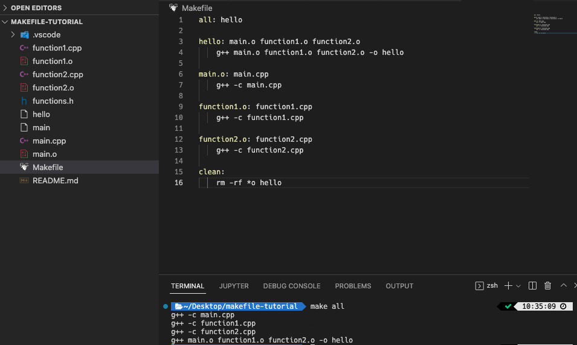

## 在 C++ 中使用 Makefile

一般編譯需要將而外引用的函式庫檔案位置附上：

```sh
g++ main.cpp function1.cpp function2.cpp -o main
```

若當有超過幾十隻附加檔案時，逐一的在指令上添加檔案路徑是非常辛苦的一件事。因此才需要透過 Makefile 幫我們管理這些檔案，讓編譯器在編譯的時候知道要處理哪些檔案。並且只編譯更動過的檔案，這意味著若先前已編譯過檔案若之後沒做更動時不會再花時間編譯一次，這動作大幅降低整體編譯的時間。

Makefile 會先執行 all 區段，後面的 hello 是代表相依要被執行的區段。因此會掉到 hello，裏面也有相依的內容 `main.o function1.o function2.o`，接著第一步會先編譯 main.o 他的相依程式為 main.cpp 並使用 gcc 指令編譯 `.o` 檔。

```makefile
all: hello

hello: main.o function1.o function2.o
		g++ main.o function1.o function2.o -o main

main.o: main.cpp
		g++ -c main.cpp

function1.o: function1.cpp
		g++ -c function1.cpp

function2.o: function2.cpp
		g++ -c function2.cpp

clean:
		rm -rf *o main
```



Makefile 進階版寫法，提供變數可以省去重複性高的內容並且好管理指令 `-c` 代表編譯但不進行鏈結的意思 `-Wall` 代表編譯時顯示所有的警告訊息。

```makefile
CC=g++
CFLAGS=-c -Wall

all: hello

hello: main.o function1.o function2.o
		$(CC) main.o function1.o function2.o -o main

main.o: main.cpp
		$(CC) $(CFLAGS) main.cpp

function1.o: function1.cpp
		$(CC) $(CFLAGS) function1.cpp

function2.o: function2.cpp
		$(CC) $(CFLAGS) function2.cpp

clean:
		rm -rf *o main
```


## Reference

- [Using make and writing Makefile ( in C++ or C )](https://www.youtube.com/watch?v=aw9wHbFTnAQ)